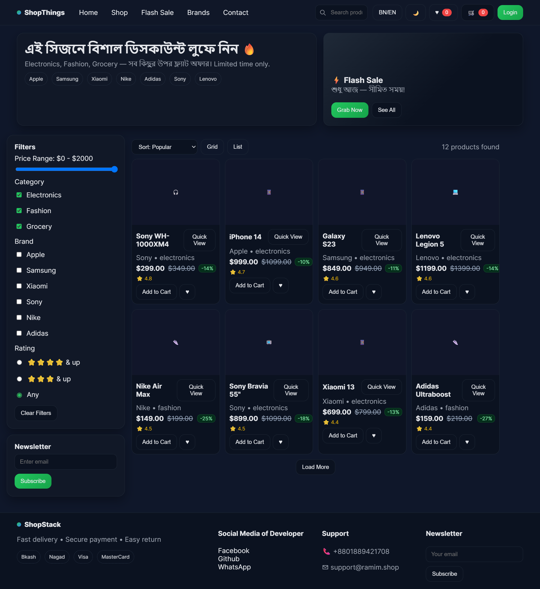

# 🛒 ShopThings — E-commerce UI Starter

[🌐 Live Demo](https://githubramim.github.io/project-5th-ecom/) 
## 📖 Project Description

**ShopThings** is a fully responsive **E-commerce UI template** built with **HTML, CSS & Vanilla JavaScript**.  
It provides a modern, user-friendly interface for showcasing products and running an online store.

✨ **Features include:**

- Hero section & flash sale banners  
- Product grid & list views  
- Filters (Price, Category, Brand, Rating)  
- Search functionality 🔍  
- Cart & Wishlist drawers 🛍️  
- Quick View modal  
- Checkout process (Address, Payment, Review) 💳  
- Coupon support 🎟️  
- Dark/Light mode toggle 🌗  
- Sticky cart button for mobile  
- Toast notifications ✅

## 🖼️ Screenshot




## ⚡ Features Details

### Header & Navigation
- Logo, navigation links, search bar, dark/light mode, cart & wishlist buttons  

### Hero Section
- Promotional message  
- Flash sale banners  
- Brand chips

### Product Listing
- Grid & list view toggle  
- Filters: Price, Category, Brand, Rating  
- Search input  
- Load more functionality

### Cart & Wishlist
- Cart drawer with product quantity management  
- Coupon code apply  
- Wishlist drawer

### Quick View
- Shows short product details  
- Add to Cart & Wishlist buttons

### Checkout Modal
- 3-step checkout: Address → Payment → Review  
- Interactive checkout form

### Others
- Toast notifications for actions  
- Sticky cart button on mobile  

## 🚀 How to Run

1. Clone the project:
```bash
git clone https://github.com/yourusername/shopstack.git
